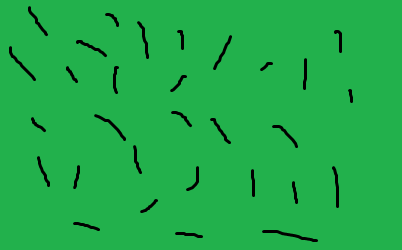

# GrowFarm
My new Project
Hi it's quite a lot of codes so I just import main dashboard.php page where all main action happens. Sorry for code I am still beginner.

         <?php
session_start();

?>

<!DOCTYPE html>
<html lang="lt" dir="ltr">
  <head>
    <meta charset="utf-8">
    <meta name="viewport" content="width=device-width, initial-scale=1.0">
    <link rel="stylesheet" href="design.css">
    <link rel="stylesheet" href="https://stackpath.bootstrapcdn.com/bootstrap/4.1.3/css/bootstrap.min.css" integrity="sha384-MCw98/SFnGE8fJT3GXwEOngsV7Zt27NXFoaoApmYm81iuXoPkFOJwJ8ERdknLPMO" crossorigin="anonymous">
    <link href="https://fonts.googleapis.com/css?family=Luckiest+Guy&display=swap" rel="stylesheet">
    <link href="https://fonts.googleapis.com/css?family=Boogaloo&display=swap" rel="stylesheet">
    <link rel="stylesheet" type="text/css" href="stilius.php">
    
    
    <title>GrowFarm</title>
  </head>
  <body>
    <header>
      

        

          

            <?php
                if (isset($_SESSION['u_id'])) {
                  echo '
 You are logged in
'.$_SESSION['u_uid'];
                }
             ?>
           

          

            <ul class="nav justify-content-center">
              <li class="nav-item">
                <a class="nav-link active linkai" href="#">Apie Mus</a>
              </li>
              <li class="nav-item">
                <a class="nav-link linkai" href="#">Apie Žaidimą</a>
              </li>
              <form  action="includes/logout.php" method="post">
                <button type="submit" name="submit" value="submit" class="btn btn-danger">Logout</button>
              </form>

               </ul>
              

      

            <a href="index.html"><h3>GROW FARM</h3></a>
      

        

      

      <?php

      $dbServername = "";
      $dbUsername = "";
      $dbPassword = "";
      $dbName = "";

                      // CREATE CONNECTION//
      $conn = mysqli_connect($dbServername, $dbUsername, $dbPassword, $dbName);
            // Check connection//
            if ($conn->connect_error) {
              die("Connection failed :".$conn->connect_error);
            }

            // THIS IS RESOURSES
        $userID = $_SESSION['u_id'];
        $sql = "SELECT * FROM resourses INNER JOIN world ON world.id = resourses.id  WHERE resourses.id='$userID'";
        $result = mysqli_query($conn, $sql);
        $row = mysqli_fetch_assoc($result);

          $wood = $row['wood'];
          $wheat = $row['wheat'];
          $cabage = $row['cabage'];
          $fruit = $row['fruit'];
          $gold = $row['gold'];
          $buildings = $row['buildings'];

                          // RESOURSE PRODUCTION
                  $sql = "SELECT * FROM production WHERE id='$userID' ";
                  $result = mysqli_query($conn, $sql);
                  $row = mysqli_fetch_assoc($result);

                  $wood_production = $row['wood_production'];
                  $wheat_production = $row['wheat_production'];
                  $cabage_production = $row['cabage_production'];
                  $fruit_production = $row['fruit_production'];

                    //BUILD BUILDING SCRIPT

                    $config = [
                      $dbserver = "mysql:host=;dbname=;",
                      $dblogin = "",
                      $dbPswd = "",

                    ];
                    try {
                      $db = new PDO(...$config);
                    } catch (\Exception $e) {
                      throw new Exception("could not connect to DB");
                    }

                    function createBuilding($location,$buildingID){
                      global $db;
                  $sql = "SELECT * FROM buildings WHERE id = ?";
                  $stmt = $db->prepare($sql);
                  $stmt->execute(array($buildingID));
                  if ($stmt->rowCount() > 0) {

                    $buildingResult = $stmt->fetchAll();

                    $userID = $_SESSION['u_id'];
                    $sql= "SELECT * FROM resourses INNER JOIN world ON world.id = resourses.id WHERE resourses.id='$userID'";
                    $stmt = $db->query($sql);
                    $result = $stmt->fetchAll();

                    $currencyARRAY = array("costwood" => $result[0]['wood'], "costgold" => $result[0]['gold']);
                    $newCurrency= array();
                    $couldnotAfford = 0;

                    foreach ($currencyARRAY as $currency => $amount) {
                      echo "COST  :  " . $buildingResult[0][$currency] . " my " . $currency . " " . $amount . " ";
                      if ($buildingResult[0][$currency] > $amount) {
                        $couldnotAfford = 1;
                        break;
                      }
                      else {
                        $newCurrency +=array($currency => $amount - $buildingResult[0][$currency]);
                      }

                    }

                    if ($couldnotAfford === 0)
                    {
                      //You can AFFORD IT
                      $ourTowArray = explode(",",$result[0]['buildings']);

                      if ($ourTowArray[$location] ==="0") {
                        $_SESSION['TownERROR MESSAGE'] ="EMTY SPACE BUILD IT!";
                        // EMPTY SPACE YOU CAN BUILDING
                        $ourTowArray[$location] = $buildingID;
                        $ourTowArray =implode(",",$ourTowArray);

                        $sql = "UPDATE world SET buildings='$ourTowArray' WHERE id='$userID'";
                        $db->query($sql);

                        $sql = "UPDATE resourses SET wood=$newCurrency[costwood], gold=$newCurrency[costgold] WHERE id='$userID'";
                        $db->query($sql);

                      }else {
                      $_SESSION['TownERROR MESSAGE'] ="THERE IS NO SPACE";

                      }
                    }
                    else
                    {
                      $_SESSION['TownERROR MESSAGE'] ="You canot afford that";
                    }

                  }else {
                  $_SESSION['TownERROR MESSAGE'] ="Buildint doesnt exist";
                  }
              }

              if (isset($_POST['location'])) {
                createBuilding($_POST['location'],$_POST['buildingID']);
              }

       ?>

  

 

 <h2>Resursai</h2>
 <ul id="Resusrsai">
   <li class="Resursai-li"> : <?php echo $wood;  ?></li>
   <li class="Resursai-li"> : <?php echo $wheat; ?></li>
   <li class="Resursai-li"> : <?php echo $cabage; ?></li>
   <li class="Resursai-li"> : <?php echo $fruit; ?></li>

 </ul>
  

  

 <h2>Produkcija</h2>
 <ul id="Resusrsai">
   <li class="Resursai-li"> : <?php echo $wood_production; ?> per valandą</li>
   <li class="Resursai-li"> : <?php echo $wheat_production; ?>per valandą</li>
   <li class="Resursai-li"> : <?php echo $cabage_production; ?>per valandą</li>
   <li class="Resursai-li"> : <?php echo $fruit_production; ?>per valandą</li>

 </ul>

 

 

 <h2>Inventorius</h2>
 <ul id="Resusrsai">
   <li class="Resursai-li"><?php echo $gold; ?>: </li>
   <li class="Resursai-li">5:</li>
   <li class="Resursai-li">500m2: </li>

 </ul>
 

 

 <?php

echo "
";

$ourBuildings = explode(",",$buildings);

//GET ALL AVAIBLE buildings

$sql = "SELECT * FROM buildings";
$result = mysqli_query($conn, $sql);
$allBuildings = array();
if (mysqli_num_rows($result)> 0) {
  while ($row = mysqli_fetch_assoc($result)){
    $allBuildings[]= $row;

  }
}

$i=0;
echo "
";
for ($y=0; $y < 3; $y++) {
  for ($x=0; $x < 3; $x++)
  {
    if ($ourBuildings[$i] == "0") {
      $text = "Nothing";
    }else {

      // GET BUILDING NAME!

      $id = $ourBuildings[$i];
      $sql = "SELECT * FROM buildings WHERE id='$id'";
      $result = mysqli_query($conn, $sql);
      $row = mysqli_fetch_assoc($result);

      $text = $row['name'];

    }
    echo "".$text."";
    $i++;
  }

}

echo "
";

echo "
";
echo "";
foreach ($allBuildings as $key => $buildingName) {
  echo "
" . $buildingName['name']. " " .
    "Medžio : ".  $buildingName['costwood'] . " " .
    "Pinigų : ".  $buildingName['costgold'] .

  "
";
}

"
";
"
";

  ?>

</body>
</html>

